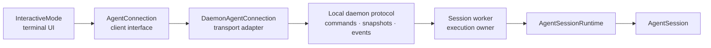

# Kiến trúc kết nối tác nhân

`AgentConnection` là ranh giới phía client giữa giao diện người dùng tương tác và quy trình sở hữu việc thực thi tác nhân. Nó cho phép giao diện người dùng đầu cuối duy trì khả năng vận chuyển bất khả tri trong khi các phiên cục bộ bình thường chạy trong các trình chạy daemon.

Đường dẫn tương tác thông thường là:



Đường dẫn nhúng và dự phòng rõ ràng có thể sử dụng `InProcessAgentConnection`, nhưng `InteractiveMode` vẫn hoạt động với cùng một giao diện.

`AgentConnection` không phải là giao thức dây daemon và không phải là giao thức cổng được lưu trữ. Nó thể hiện ý định của client trong TypeScript. Mỗi bộ điều hợp vận chuyển chịu trách nhiệm đóng khung, tạo phiên bản, phục hồi và dịch thuật ở ranh giới riêng của nó.

## Trách nhiệm

Kết nối hiển thị các hoạt động của client cho:

- nhắc nhở, chỉ đạo, theo dõi, hủy bỏ và chờ đợi không hoạt động;
- cài đặt mô hình, tầng dịch vụ, suy nghĩ, vận chuyển và xếp hàng;
- nén, thử lại, sàng lọc và điều hướng phiên;
- trạng thái phiên, bảng điểm, cây, bối cảnh, số liệu thống kê và hàng đợi;
- danh mục mô hình và tài nguyên;
- hoạt động lưu phiên và nhập/xuất;
- yêu cầu giao diện người dùng mở rộng có thể tuần tự hóa; Và
- Ảnh chụp nhanh trẻ em RLM, tin nhắn của tác nhân, lịch trình và nhịp tim.

Chủ sở hữu thực thi vẫn chịu trách nhiệm đối với các cuộc gọi của nhà cung cấp, công cụ, hạt nhân, hàng đợi, nén, lập lịch, duy trì và hậu duệ RLM.

## Triển khai

### Kết nối DaemonAgent

`DaemonAgentConnection` là bộ điều hợp tương tác cục bộ tiêu chuẩn. Nó sở hữu `DaemonClient`, ID phiên hoạt động, ảnh chụp nhanh mới nhất, con trỏ sự kiện cuối cùng, tập hợp ảnh chụp nhanh được phát trực tuyến và hành vi kết nối lại.

Khi đính kèm, nó quảng cáo các khả năng được hỗ trợ và nhận được ảnh chụp nhanh phiên mạch lạc. Bản ghi lớn được chuyển dưới dạng bản ghi bắt đầu/đoạn/kết thúc. Các sự kiện trực tiếp mang con trỏ nhận biết thế hệ:

```text
{ generation, sequence }
```

Bộ điều hợp từ chối các sự kiện trùng lặp hoặc đã ngừng hoạt động. Sau khi mất ổ cắm tạm thời, nó sẽ kết nối lại với cùng một danh tính client và con trỏ cuối cùng, gắn lại và phát ra ảnh chụp nhanh được đồng bộ hóa lại. Nếu không có tính năng phát lại tăng dần thì ảnh chụp nhanh phiên là nguồn thông tin chính xác.

Các tập tin chính:

- `src/modes/agent-connection/daemon-agent-connection.ts`
- `src/modes/daemon/daemon-client.ts`
- `src/modes/daemon/daemon-protocol.ts`

### InProcessAgentConnection

`InProcessAgentConnection` bao bọc `AgentSessionRuntime` để có khả năng tương thích với SDK và các dự phòng cục bộ rõ ràng. Nó có thể truy cập các đối tượng thời gian chạy và phiên vì nó là một bộ chuyển đổi; giao diện người dùng có thể không.

Quá trình khởi động trong quá trình cũng có thể cung cấp `InteractiveModeLocalSessionHost` cho hành vi mở rộng mang lại cuộc gọi lại cục bộ. Các hàm JavaScript và lệnh gọi lại kết xuất không bao giờ vượt qua ranh giới kết nối chung.

Các tập tin chính:

- `src/modes/agent-connection/in-process-agent-connection.ts`
- `src/modes/interactive/interactive-mode-services.ts`

## Trạng thái, Sự kiện và Ảnh chụp nhanh

`AgentConnectionState` là chế độ xem trạng thái thực thi được lưu trong bộ nhớ đệm của giao diện người dùng. Nó bao gồm phiên hoạt động, cấu hình mô hình và suy nghĩ, trạng thái luồng và nén, chế độ hàng đợi, nhận dạng phiên, mục tiêu, công cụ và cách sử dụng ngữ cảnh.

Ảnh chụp nhanh ban đầu hoặc thay thế kết hợp:

- trạng thái kết nối;
- tin nhắn bảng điểm;
- bối cảnh phiên;
- chuỗi sự kiện và con trỏ cuối cùng;
- ảnh chụp nhanh con RLM đang hoạt động; Và
- một tin nhắn hỗ trợ đang được thực hiện khi có.

Các sự kiện kết nối bao gồm các sự kiện phiên, ảnh chụp nhanh thay thế và đồng bộ hóa lại, yêu cầu giao diện người dùng mở rộng, trạng thái kết nối và đóng thiết bị đầu cuối. Bộ điều hợp cập nhật bộ đệm của nó trước khi thông báo cho giao diện người dùng.

Một số loại kết nối vẫn sử dụng lại `AgentMessage`, `AgentEvent` nội bộ và các loại mô hình. Đó là những hợp đồng TypeScript cục bộ, không phải lời hứa về một lược đồ mạng công cộng ổn định.

## Kết nối lại và phát lại

Kết nối lại và phục hồi sử dụng các cơ chế sau:

1. Lệnh sử dụng ID client và ID lệnh ổn định.
2. Các đột biến được `clientId + commandId` ghi lại.
3. Các sự kiện mang một con trỏ có thế hệ worker và trình tự đơn điệu.
4. Đính kèm chấp nhận con trỏ sơ yếu lý lịch.
5. Kết nối lại thử khôi phục người giám sát trong một khoảng thời gian giới hạn.
6. Đính kèm trả về trạng thái phát lại và ảnh chụp nhanh mạch lạc, được truyền theo từng đoạn khi cần thiết.
7. Giao diện người dùng nhận được `session_resynced` sau khi khôi phục.

Vấn đề thay đổi thế hệ: số thứ tự chỉ có ý nghĩa bên trong thế hệ của nó. Client không được so sánh các giá trị chuỗi trần giữa các thế hệ worker.

Giao thức không hứa hẹn rằng mọi sự kiện lịch sử đều có thể phát lại được. Trạng thái phiên bền vững và ảnh chụp nhanh mới là cơ sở phục hồi; phát lại là sự tối ưu hóa cho khoảng thời gian mà máy chủ vẫn có thể đáp ứng.

## Vòng đời lệnh và tính tạm thời

Giao thức daemon công khai có khung JSONL và hiện ở giao thức v4. Các lệnh có thể được gửi trong các phong bì được phiên bản chứa siêu dữ liệu giao thức, ID client và ID lệnh.

Các lệnh đột biến được ghi lại trước khi gửi đi. Lệnh hoàn thành được lặp lại sẽ trả về kết quả đã ghi của nó. Một lệnh được biết là đã được nhận nhưng thiếu kết quả lâu dài sẽ được báo cáo là không chắc chắn thay vì được thực hiện lại một cách mù quáng. Client thừa nhận kết quả lâu dài nên các mục nhật ký cũ có thể được nén lại.

Lời hứa của phương pháp `AgentConnection` là mang lại sự thuận tiện cho client. Nó không được coi là quy trình làm việc từ xa được chấp nhận/đang chạy/hoàn thành chung API.

## Thay thế phiên

Các hoạt động mới, chuyển đổi, rẽ nhánh, nhập và điều hướng cây có thể thay thế thời gian chạy đằng sau một kết nối đang hoạt động. Bộ điều hợp sở hữu chức năng đóng lại và phát ra ảnh chụp nhanh thay thế. Giao diện người dùng áp dụng trạng thái và bảng điểm mới; nó không tua lại trực tiếp trình nghe `AgentSession`.

Khi chuyển sang phiên đã được sở hữu bởi một worker thường trú khác, client không thuộc sở hữu có thể gắn lại vào phiên hoạt động đó. Những worker không đầu thuộc sở hữu của client không âm thầm chuyển quyền sở hữu.

## Ranh giới giao diện người dùng mở rộng

Các tiện ích mở rộng do Daemon sở hữu có thể yêu cầu các thao tác giao diện người dùng có thể tuần tự hóa như chọn, xác nhận, nhập, chỉnh sửa, thông báo, trạng thái, tiện ích, tiêu đề và cập nhật văn bản soạn thảo. Client xác thực tải trọng và trả về phản hồi có thể tuần tự hóa.

Các cuộc gọi lại có thể thực thi được loại trừ có chủ ý:

- công cụ `execute`, chuẩn bị đối số và các chức năng kết xuất tùy chỉnh;
- cuộc gọi lại của người chạy mở rộng;
- chức năng hoàn thành cục bộ; Và
- đối tượng quản lý phiên hoặc thời gian chạy.

Những người ở lại trong quá trình tải phần mở rộng. Tiện ích mở rộng cục bộ là mã đáng tin cậy và chạy với quyền xử lý của người dùng.

## Dịch vụ giao diện người dùng cục bộ

Kết xuất thiết bị đầu cuối, xử lý bàn phím, tổ hợp phím, chủ đề, truy cập bảng tạm, thiết lập thông tin xác thực cục bộ và các tùy chọn giao diện người dùng lâu dài là những mối quan tâm của client. Chúng thuộc về `InteractiveModeUiServices` hoặc dịch vụ client khác, không thuộc giao thức thực thi.

Quy tắc quyết định rất đơn giản: nếu một hành động thay đổi việc thực thi tác nhân hoặc trạng thái phiên được duy trì, nó sẽ chuyển qua `AgentConnection`. Nếu nó chỉ thay đổi cách trình bày thiết bị đầu cuối hoặc giao diện người dùng tùy chọn cục bộ thì nó vẫn ở phía client.

## Dữ liệu chỉ cục bộ

Một số hoạt động có chủ ý bảo toàn ngữ nghĩa của hệ thống tệp cục bộ, bao gồm các đường dẫn phiên đã lưu và đường dẫn nhập/xuất. Không mở rộng các hình dạng này thành API từ xa. Phương tiện truyền tải được lưu trữ phải sử dụng ID tạo tác và phiên không rõ ràng, dấu thời gian chuỗi và các thẻ điều khiển tải lên/tải xuống rõ ràng.

## Bất biến biên

`InteractiveMode` không được phụ thuộc vào:

- `AgentSessionRuntime` hoặc `AgentSession`;
- `SessionManager`;
- đường dẫn ổ cắm daemon, client hoặc loại lệnh;
- bộ phát sự kiện thực thi trong quá trình; hoặc
- lệnh gọi lại thời gian chạy có thể thực thi được phân phối qua `AgentConnection`.

Mã khởi động là gốc của thành phần và có thể biết về các bộ điều hợp cụ thể, khởi động daemon, cài đặt cục bộ và xây dựng thời gian chạy dự phòng.

## Thử nghiệm

Các bài kiểm tra tập trung thực thi hành vi ranh giới và phục hồi:

- `test/interactive-mode-boundary.test.ts`
- `test/agent-connection-daemon.test.ts`
- `test/agent-connection-in-process.test.ts`
- `test/daemon-client.test.ts`
- `test/daemon-protocol.test.ts`
- `test/main-interactive-routing.test.ts`

Khi thay đổi kết nối hoặc bề mặt dây, hãy phân loại thay đổi đó là tương thích ngược, hạn chế khả năng hoặc không tương thích. Cập nhật siêu dữ liệu giao thức/lược đồ và phạm vi bao phủ của cả client cũ/daemon mới và client mới/daemon cũ cho mỗi lần thay đổi dây.

## Mối quan hệ với việc thực thi trên máy chủ

Ranh giới cục bộ phù hợp với một bộ điều hợp khác, nhưng nó không xác định mặt phẳng điều khiển được lưu trữ. Hệ thống được lưu trữ vẫn cần xác thực, ủy quyền, nhận dạng hộp cát, chuyển tạo tác, DTO công khai ổn định, quyền sở hữu nhiều client và chính sách tương thích ở cấp độ mạng một cách rõ ràng.

Quy tắc kiến ​​trúc bền vững hẹp hơn và đã được thực thi: giao diện người dùng có thể phong phú và dành riêng cho client, nhưng nó không thể sở hữu việc thực thi tác nhân.
