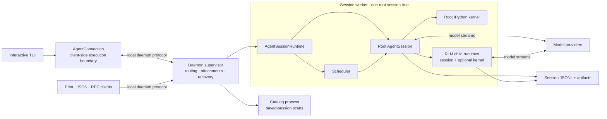
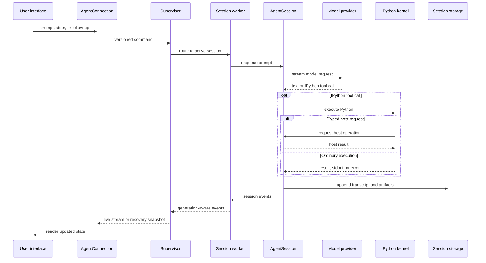

# Tổng quan về kiến ​​trúc

Prime Agent tách biệt việc trình bày thiết bị đầu cuối, điều phối quy trình, thực thi tác nhân, Python đối mặt với mô hình và trạng thái bền vững. Các phiên tương tác thông thường sử dụng đường dẫn được hỗ trợ bằng daemon bên dưới; SDK rõ ràng và tích hợp dự phòng có thể chạy cùng một `AgentSessionRuntime` trong quá trình xử lý.

## Sơ lược về hệ thống

- Client sở hữu kết xuất, nhập liệu bằng bàn phím và các tùy chọn giao diện người dùng cục bộ; nó không sở hữu việc thực thi.
- Người giám sát sở hữu khả năng khám phá, định tuyến, tệp đính kèm, tình trạng worker và gửi tin nhắn giữa các tác nhân.
- Mỗi worker sở hữu một thời gian chạy gốc, bộ lập lịch, hạt nhân và tất cả con cháu bên dưới gốc đó.
- `AgentSession` sở hữu các cuộc gọi, hàng đợi, công cụ, nén, mục tiêu, vòng đời con và ghi bản ghi của nhà cung cấp.
- IPython là môi trường điều khiển hướng tới mô hình. Các yêu cầu máy chủ đã nhập sẽ trả về các hoạt động có thẩm quyền cho phiên TypeScript.

Worker và hạt nhân là các quy trình riêng biệt để ngăn chặn vòng đời và lỗi, không phải là hộp cát bảo mật. Chúng thường chạy với cùng quyền của hệ điều hành với client.

## Luồng thực thi nhắc nhở

Từ hàng đợi phiên trở đi, đường dẫn thực thi và lưu giữ tương tự sẽ được sử dụng khi lời nhắc đến từ nhịp tim, lịch trình cron, tiếp tục mục tiêu, chế độ tự trị hoặc tác nhân khác thay vì người dùng được đính kèm.

## Kiến trúc chi tiết

- [Kiến trúc kết nối tác nhân](agent-connection.vi.md) giải thích ranh giới client/thời gian chạy, ảnh chụp nhanh, hành vi phát lại và kết nối lại.
- [Daemon Architecture](daemon.vi.md) bao gồm quyền sở hữu quy trình, cho thuê, lập kế hoạch, áp lực ngược và khắc phục sự cố.
- [RLM Kiến trúc thời gian chạy](rlm-runtime.vi.md) tuân theo các yêu cầu máy chủ IPython và thực thi con đệ quy.
- [Tác nhân nền và chạy dài](long-running-agents.vi.md) hiển thị cách các phiên, thông báo, mục tiêu và công việc đã lên lịch chia sẻ thời gian chạy của worker.
