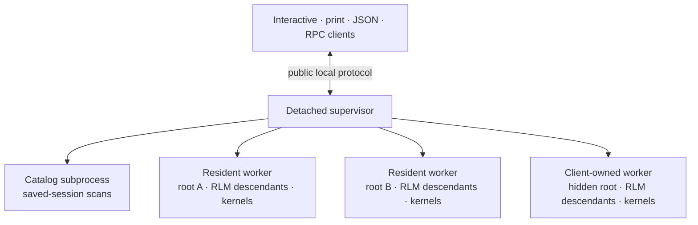

# Kiến trúc Daemon

Prime Agent cô lập từng cây phiên gốc đang hoạt động trong quy trình riêng của nó. Daemon là cơ sở hạ tầng nội bộ: tương tác, in, JSON, RPC, piped-stdin và `--no-session` mô tả hành vi của client và duy trì các hợp đồng I/O công khai của họ.

## Cấu trúc liên kết quy trình



Người giám sát sở hữu các ổ cắm công cộng, tệp đính kèm client, định tuyến, gửi thông báo tác nhân toàn cầu, sức khỏe worker, nhật ký lệnh và các bản cập nhật phối hợp. Nó không thực thi các nhà cung cấp, công cụ, nén, bash, kernel, lịch trình hoặc quét bản ghi.

Quy trình con danh mục sở hữu các lần quét phiên đã lưu và các thao tác tệp phiên không hoạt động. Lỗi danh mục có thể khiến yêu cầu danh mục không thành công mà không làm gián đoạn worker đang hoạt động.

Mỗi worker sở hữu một gốc `AgentSessionRuntime`, `AgentSession` gốc, bộ lập lịch, hạt nhân và mọi hậu duệ RLM bên dưới gốc đó. Các hoạt động mới, chuyển đổi, phân nhánh và nhập thay thế thời gian chạy gốc bên trong trình chạy trong khi vẫn giữ ID phiên hoạt động công khai.

## Worker thường trú

Các phiên tương tác thông thường sử dụng worker thường trú:

- Người giám sát bắt đầu một nhóm quy trình tách rời trên mỗi cây gốc đang hoạt động.
- Đóng TUI sẽ tách client; nó không ngăn cản người worker.
- Bộ mô tả worker, mã thông báo xác thực, ID phiên hoạt động, đường dẫn phiên và nhật ký khôi phục được viết với quyền chỉ dành cho chủ sở hữu trong thư mục tác nhân.
- Worker giám sát ổ cắm giám sát công cộng. Nếu nó biến mất, một worker sẽ có được hợp đồng thuê phóng nguyên tử và tìm người giám sát thay thế.
- Người giám sát thay thế chấp nhận worker trực tiếp và ID phiên hoạt động của họ.
- Một vụ tai nạn worker ảnh hưởng đến một cây gốc. Khôi phục lại sau 250 mili giây, 1 giây và 5 giây; ba lỗi đánh dấu rằng root không thành công.
- `prime-agent shutdown` dừng người giám sát và tất cả worker; `--force` cũng chấm dứt các nhóm quy trình worker không phản hồi và các nhóm quy trình con được theo dõi.

Không có giới hạn phiên, worker, client hoặc khối lượng công việc cố định trong lớp này.

## Worker thuộc sở hữu của client

Các client không đầu và tạm thời sử dụng cùng thời gian chạy của worker như các client tương tác nhưng cung cấp cho worker một vòng đời do client sở hữu:

- chế độ in, stdin theo đường ống và JSON vẫn duy trì một lần;
- RPC giữ nguyên khung JSONL được phân tách bằng LF và chấp nhận lời nhắc cho đến EOF;
- `--no-session` tương tác sử dụng phiên trong bộ nhớ;
- hoàn thành bình thường sẽ loại bỏ worker một cách rõ ràng mà không lưu trữ nó;
- việc mất client bất ngờ bắt đầu thời gian gia hạn dọn dẹp có giới hạn;
- kết nối lại với cùng một danh tính client ổn định sẽ hủy bỏ việc dọn dẹp; Và
- danh sách mặc định, lịch trình toàn cầu và định tuyến ngang hàng bỏ qua các worker thuộc sở hữu của client trừ khi chủ sở hữu giải quyết rõ ràng chúng.

Môi trường khởi chạy đầy đủ vẫn còn trong bộ nhớ giám sát và không được ghi vào bộ mô tả worker. Lệnh gọi SDK trực tiếp để in và các chế độ RPC vẫn đang được xử lý để các trình nhúng có thể vượt qua các nhà máy mở rộng không tuần tự hóa.

## Quyền sở hữu và cho thuê phiên

Mỗi phiên liên tục đều được bảo vệ bằng hợp đồng thuê quy trình an toàn được khóa bằng đường dẫn JSONL chuẩn.

- Một worker có được hợp đồng thuê mục tiêu trước khi mở phiên.
- Thời gian thay thế có được hợp đồng thuê mới trước khi phát hành hợp đồng cũ.
- Mở đồng thời trả về `session_already_active` với ID phiên hoạt động sở hữu.
- Tạo đồng thời cho cùng một đường dẫn hội tụ trên một lần khởi chạy worker.

Điều này ngăn cản worker daemon và client one-shot đồng thời viết cùng một bản ghi.

## Lên lịch

Mỗi worker chạy một bộ lập lịch cho gốc và con cháu của nó. Công việc được duy trì mỗi phiên trong `session-artifacts/<session-id>/scheduled-jobs.json`; worker không chia sẻ tệp cron toàn cầu.

Các dấu hiệu đến hạn được yêu cầu và nâng cao trước khi giao hàng nhanh chóng. Do đó, sự cố không phát lại lời nhắc không chắc chắn. Các phiên mục tiêu khác nhau sẽ được gửi đi một cách độc lập và một yêu cầu vẫn đang hoạt động sẽ kết hợp lại sau những dấu tích bị bỏ lỡ thay vì tạo ra một hồ sơ tồn đọng không giới hạn.

Worker thường trú tiếp tục lên lịch thay thế người giám sát. Quá trình phục hồi của worker đánh dấu các yêu cầu bồi thường không chắc chắn bị gián đoạn, giữ nguyên lịch trình nâng cao và chỉ tiếp tục các dấu tích trong tương lai. Người giám sát định tuyến các lệnh lập lịch và hợp nhất các bản tóm tắt worker để liệt kê toàn cầu.

## Giao thức Daemon công khai v4

Ổ cắm cục bộ công cộng có khung JSONL. Giao thức hiện tại cung cấp:

- phong bì lệnh được phiên bản với ID lệnh và client ổn định;
- siêu dữ liệu đàm phán khả năng và khả năng tương thích theo lệnh;
- con trỏ sự kiện nhận biết thế hệ `{ generation, sequence }`;
- kết nối lại với danh tính ổn định và tiếp tục con trỏ;
- đính kèm xác nhận cộng với ảnh chụp nhanh mạch lạc;
- phát trực tiếp ảnh chụp nhanh bắt đầu/phân đoạn/kết thúc với kích thước phân đoạn mục tiêu 512 KiB;
- bộ nhớ đệm bản sao được hỗ trợ bằng tệp trên 4 MiB;
- các lệnh vòng đời của worker thường trú và client sở hữu;
- các hoạt động hoàn thành không đầu, tiêu đề phiên, bash và thử lại phía daemon; Và
- lỗi cấu trúc đối với các trường hợp có thể phục hồi, chẳng hạn như phiên đã hoạt động hoặc kết quả đột biến không chắc chắn.

Phiên bản giao thức và sửa đổi lược đồ là độc lập. Phần bổ sung tương thích có thể bị hạn chế về khả năng hoặc yêu cầu sửa đổi lược đồ; một sự thay đổi dây không tương thích đòi hỏi phải có một sự thay đổi về giao thức.

Giao thức v1 chỉ được giữ lại cho bản chuyển giao cập nhật một bản phát hành nhằm chuẩn bị và dừng một trình nền cũ hơn. Một daemon cũ bận rộn không thể tạo ra bản kê khai khôi phục vẫn đang chạy.

Các chế độ client JSON và RPC không hiển thị lời chào daemon, phong bì, bản ghi ảnh chụp nhanh, sự kiện vòng đời hoặc siêu dữ liệu kết nối.

## Kết nối lại, Phát lại và Ảnh chụp nhanh

Mỗi sự kiện theo trình tự đều thuộc về một thế hệ worker. Client giữ lại con trỏ `{ generation, sequence }` cuối cùng và hiển thị nó trên tệp đính kèm. Máy chủ báo cáo khoảng thời gian được yêu cầu là đầy đủ, một phần hay không có sẵn.

Sự thay đổi thế hệ làm mất hiệu lực so sánh với trình tự cũ. Việc thiếu tính năng phát lại không gây tử vong: ảnh chụp nhanh đính kèm là đường cơ sở phục hồi lâu bền. `DaemonAgentConnection` áp dụng ảnh chụp nhanh, bỏ qua các sự kiện trùng lặp hoặc đã ngừng tạo và báo cáo phiên được đồng bộ hóa lại cho giao diện người dùng.

Các ảnh chụp nhanh lớn được mã hóa trong trình chạy và được truyền dưới dạng các đoạn mờ thông qua bộ nhớ đệm giám sát được giới hạn. Người giám sát không bao giờ xây dựng một đối tượng có kích thước lịch sử.

## Vận chuyển worker tư nhân

Lưu lượng giám sát-worker sử dụng khung nhị phân:

```text
4-byte JSON header length
4-byte payload length
small JSON routing header
opaque payload bytes
```

Worker sắp xếp một sự kiện công cộng một lần. Người giám sát chỉ đọc tiêu đề định tuyến và chuyển tiếp bộ đệm tải trọng tương tự đến các client đủ điều kiện.

Tính năng phát trực tuyến của Trợ lý sử dụng tải trọng bắt đầu/delta/kết thúc nhỏ gọn một cách riêng tư. Người giám sát xây dựng lại `message_update` công khai hiện có một lần cho mỗi delta, do đó, thông báo trợ lý đang phát triển đầy đủ không được chuyển đi lặp lại nhiều lần từ worker sang người giám sát.

Các kết nối worker tư nhân xác thực bằng mã thông báo cho mỗi worker và được giới hạn cho thế hệ giám sát viên hiện tại. Điều này ngăn cản người giám sát thay thế lỗi thời tiếp tục chỉ huy một worker được nhận nuôi. Đó là sự phối hợp quy trình, không phải ranh giới hộp cát: tất cả các quy trình vẫn chạy với cùng một người dùng hệ điều hành.

## Áp lực ngược

Áp suất ngược là tệp đính kèm cục bộ:

- một client bị chặn ngừng nhận các sự kiện gia tăng;
- các client và worker khác tiếp tục;
- người giám sát không giữ lại hàng đợi không giới hạn cho mỗi client; Và
- sau khi thoát, tệp đính kèm sẽ bắt đầu từ con trỏ của nó hoặc nhận được ảnh chụp nhanh mới.

Bộ nhớ đệm bản ghi cuối cùng tách biệt với quá trình tái tạo một phần thông báo trực tiếp.

## Idempotency và phục hồi sự cố

Các lệnh đột biến được khóa bởi `clientId + commandId` và được ghi lại trước khi gửi đi trong nhật ký chỉ có phần bổ sung.

- Lặp lại lệnh đã hoàn thành sẽ trả về kết quả đã lưu.
- Lệnh nhận được mà không có kết quả lâu dài sẽ được báo cáo là không chắc chắn và không được phát lại.
- Kết nối lại giữ nguyên ID lệnh.
- Client ghi nhận các đột biến đã hoàn thành để các mục nhật ký có thể được nén lại.

Nhật ký worker chuyển đổi hoạt động và nhận dạng quy trình con tách rời. Sau sự cố của worker, quá trình khôi phục sẽ lấy lại nhóm quy trình cũ của nó và theo dõi các cây bash tách rời, gắn dấu hiệu khôi phục hiển thị vào bản ghi, khôi phục gốc dưới cùng một ID phiên hoạt động và không phát lại các tác dụng phụ không chắc chắn.

## Cập nhật phối hợp

Chuẩn bị cập nhật gồm hai giai đoạn:

1. Worker thường trú tạo song song các điểm kiểm tra không phá hủy.
2. Người giám sát xác thực và duy trì bản kê khai tổng hợp một cách nguyên tử.
3. Chỉ sau khi mỗi lần chuẩn bị thành công, nó mới cam kết và dừng worker.

Nếu quá trình chuẩn bị hoặc xác thực bảng kê khai không thành công, các worker đã chuẩn bị sẽ được giải phóng và tất cả các gốc tiếp tục chạy.

## Điểm chuẩn

Từ `packages/coding-agent`:

```sh
npx tsx test/daemon-multiclient-bench.ts
npx tsx test/daemon-multiclient-bench.ts --generated-session-mib 100
npx tsx test/daemon-multiclient-bench.ts --generated-session-mib 500
npx tsx test/daemon-multiclient-bench.ts --session-file /path/to/session.jsonl
PRIME_AGENT_STRESS_WORKERS=50 npx tsx ../../node_modules/vitest/dist/cli.js --run test/daemon-supervisor-process.test.ts -t "hosts resident roots"
```

Điểm chuẩn so sánh các đường dẫn phân ra và đính kèm, bao gồm số lượng tuần tự, thông lượng, thời gian đã trôi qua và RSS được lấy mẫu. Trường hợp căng thẳng bắt đầu từ nhiều cư dân gốc và xác minh rằng lịch trình của họ tiến triển độc lập trong khi các phiên họp bận rộn.
