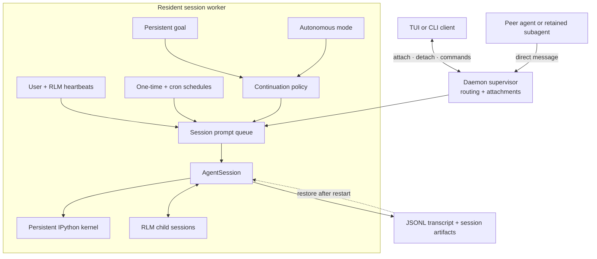

# Agent chạy dài và chạy nền

Prime Agent kết hợp các worker phiên dựa trên daemon với trạng thái bền vững, prompt được lập lịch, nhắn tin trực tiếp giữa các agent, mục tiêu và các lần tiếp tục tự động có giới hạn. Những tính năng này phục vụ các mục đích khác nhau nhưng dùng chung runtime phiên và worker.

## Luồng runtime



Client có thể detach bất cứ lúc nào. Worker thường trú tiếp tục sở hữu hàng đợi, lịch, phiên, kernel, các hậu duệ và trạng thái đã lưu.

## Phiên dựa trên daemon

Các phiên tương tác thông thường chạy trong những tiến trình worker thường trú do một supervisor cục bộ quản lý. Worker sở hữu phiên gốc, kernel IPython, các job đã lập lịch và các hậu duệ RLM.

Đóng giao diện terminal chỉ detach client; thao tác này không dừng worker. Liệt kê và kết nối lại với các agent đang hoạt động bằng:

```bash
prime-agent list
prime-agent attach <agent>
```

Các lệnh vòng đời khác:

```bash
prime-agent agents                  # Open the agents view
prime-agent rename <agent> <name>   # Give an agent a stable readable name
prime-agent stop <agent>            # Stop one agent
prime-agent status                  # Inspect background services
prime-agent doctor [--fix]          # Diagnose or repair service state
prime-agent shutdown [--force]      # Stop all agents and services
```

Worker lưu transcript dưới dạng JSONL và lưu trạng thái riêng của từng tính năng trong thư mục artifact của phiên. Khi worker hoặc supervisor khởi động lại, trạng thái phiên và lịch có thể được khôi phục, đồng thời các con RLM đã hoàn tất nhưng được giữ lại có thể được tái tạo mà không coi client terminal là chủ sở hữu công việc.

Worker daemon được cô lập theo tiến trình để quản lý vòng đời và khoanh vùng lỗi, không phải để sandbox bảo mật. Thông thường chúng chạy với cùng quyền hệ điều hành như client.

## Giao tiếp giữa các agent

Daemon định tuyến các tin nhắn trực tiếp giữa các phiên đang hoạt động và các subagent dựa trên daemon được giữ lại. Từ shell:

```bash
prime-agent send <agent> "Please verify the latest migration"
```

Từ kernel IPython, dùng skill Python `agent_message` được nạp sẵn:

```python
roster = await agent_message.list_agents()
receipt = await agent_message.send(
    "Recheck the endpoint after the latest edit",
    receiver_role="sibling",
    receiver_name="api-reviewer",
    mode="auto",
)
print(receipt["deliveryStatus"])
```

Đối với các con RLM trực tiếp của parent hiện tại, ưu tiên registry theo phạm vi parent:

```python
children = await rlm.list_subagents()
child = next(item for item in children if item.session_name == "api-reviewer")
await agent_message.send(
    "Continue with the updated diff",
    receiver_role="child",
    receiver_name=child.session_name,
)
```

Các chế độ phân phối:

- `auto`: điều hướng target đang bận và phân phối ngay cho target đang rảnh;
- `steer`: chủ động chèn tin nhắn vào công việc đang hoạt động; và
- `follow_up`: chờ đến khi công việc hiện tại của target hoàn tất.

Receipt có trạng thái `delivered` khi tin nhắn đến context của target đang rảnh hoặc `queued` khi được chấp nhận để phân phối sau. `agent_message.send("all", message)` chỉ broadcast trong roster cùng family. Daemon tự xác định danh tính người gửi và áp dụng giới hạn kích thước tin nhắn, tốc độ cũng như hàng đợi đang chờ.

## Heartbeat và prompt đã lập lịch

Prime Agent có ba bề mặt lập lịch liên quan:

| Bề mặt | Chủ sở hữu | Mục đích |
|---|---|---|
| `/heartbeat` | Người dùng | Một chỉ thị lặp lại hiển thị được cho phiên hiện tại. |
| `rlm_heartbeat` | Agent | Nhiều chỉ thị lặp lại được quản lý bằng chương trình trong phiên hiện tại. |
| `prime-agent schedule` | Người dùng hoặc automation | Prompt một lần hoặc cron tổng quát nhắm đến một agent. |

### Heartbeat của người dùng

Tạo và quản lý heartbeat hiển thị của phiên hiện tại:

```text
/heartbeat every 10m Check the deployment and report meaningful changes
/heartbeat status
/heartbeat pause
/heartbeat resume
/heartbeat clear
```

Mặc định heartbeat được phân phối theo cách điều hướng công việc đang hoạt động. Thêm `--follow-up` khi prompt lặp lại cần chờ turn hiện tại hoàn tất. Dùng `/heartbeats` để kiểm tra và quản lý cả heartbeat do người dùng lẫn agent tạo.

### Heartbeat RLM do agent tạo

Agent có thể tạo nhiều heartbeat nội bộ bằng chương trình:

```python
first = await rlm_heartbeat.create(
    "check whether the test run finished",
    interval="5m",
    label="tests",
)
second = await rlm_heartbeat.create(
    "inspect the deployment status",
    interval="10m",
    label="deploy",
    delivery_mode="follow_up",
)

await rlm_heartbeat.list()
await rlm_heartbeat.update(first["heartbeat"]["id"], status="pause")
```

Heartbeat RLM khác với `/heartbeat` của người dùng; skill Python không thể thay thế hoặc xóa heartbeat thuộc sở hữu người dùng.

### Lịch tổng quát

Lập lịch prompt một lần hoặc lặp lại cho một agent có thể định địa chỉ:

```bash
prime-agent schedule add worker "in 30m" -- "Check the benchmark result"
prime-agent schedule add worker "0 9 * * 1-5" -- "Review open work"
prime-agent schedule list --all
prime-agent schedule cancel <job-id>
```

Job đã lập lịch được lưu theo từng phiên và tiếp tục chạy khi UI đã detach. Các tick đến hạn được claim trước khi phân phối để crash không phát lại một prompt chưa rõ trạng thái, còn các tick bị lỡ được gộp thay vì tích lũy thành backlog không giới hạn.

## Mục tiêu bền vững

Mục tiêu là một mục tiêu lâu bền mà harness tiếp tục trình bày qua các turn cho đến khi hoàn tất, tạm dừng, chạm giới hạn ngân sách, gặp lỗi hoặc bị xóa. Khởi động rõ ràng từ TUI:

```text
/goal Ship the release and verify every published artifact
/goal --budget 200000 Complete the repository migration
```

Quản lý trạng thái bằng:

```text
/goal status
/goal pause
/goal resume
/goal clear
```

Model dùng skill `goal` phía kernel để kiểm tra hoặc hoàn tất mục tiêu:

```python
state = await goal.get()
await goal.complete()
```

Bản ghi trạng thái mục tiêu lưu số token đã dùng, thời gian trôi qua, số lần tiếp tục và ngân sách token rõ ràng tùy chọn. Harness tiếp tục nhắc một mục tiêu đang hoạt động sau các turn assistant thông thường; chỉ `goal.complete()` mới đánh dấu hoàn tất thành công. Tạo mục tiêu bền vững là hành động rõ ràng của người dùng hoặc host, không phải điều agent nên tự suy ra từ mọi tác vụ.

## Chế độ tự động

Chế độ tự động là một policy có giới hạn của host cho các lượt chạy không dự kiến có người nhập. Prime Agent thêm các lần tiếp tục cho đến khi các quality gate đã cấu hình đạt hoặc chạm giới hạn về số lần tiếp tục, turn, token hoặc thời gian đồng hồ.

Bật trong phiên tương tác:

```text
/autonomous on
/autonomous status
/autonomous off
```

Hoặc cấu hình một lượt chạy từ CLI:

```bash
prime-agent \
  --autonomous \
  --autonomous-gate "npm run check" \
  --autonomous-max-turns 20 \
  "Implement and verify the requested change"
```

Chế độ tự động hỗ trợ giới hạn cho số lần tiếp tục, turn assistant, token và thời lượng theo đồng hồ. Lệnh gate chạy trước khi phiên được phép kết thúc; gate thất bại trả output có giới hạn về cho agent để thử lại. Prime Agent tránh chạy lại cùng gate thất bại khi workspace chưa thay đổi.

Mục tiêu và chế độ tự động bổ trợ nhưng khác nhau:

- **mục tiêu** lưu objective và trạng thái tiến độ qua các turn;
- **chế độ tự động** quyết định có chèn thêm một lần tiếp tục hay không dựa trên bằng chứng, gate và giới hạn.

## Compaction và tính liên tục

Compaction tự động xử lý việc context tăng lên trong các tác vụ dài. Khi tràn hoặc gần ngưỡng đã cấu hình, Prime Agent tóm tắt các message cũ, giữ lại context gần đây và tiếp tục. Kernel IPython tồn tại qua compaction, nên biến, import, helper function và trạng thái tác vụ vẫn còn.

Agent có thể kiểm tra hoặc yêu cầu compaction bằng chương trình:

```python
await compact.status()
await compact.run("Preserve the failing tests and remaining migration steps")
```

Compaction không phải tín hiệu hoàn tất. Nó không dừng mục tiêu, các lần tiếp tục tự động, heartbeat hoặc các phiên con hiện có; các turn parent sau đó tiếp tục từ context đã compact.

Để biết hành vi cấp thấp hơn về tiến trình và khôi phục, xem [Kiến trúc Daemon](daemon.vi.md). Để biết chi tiết vòng đời con đệ quy, xem [Mô hình Lập trình RLM](rlm.vi.md) và [Kiến trúc Runtime RLM](rlm-runtime.vi.md).
