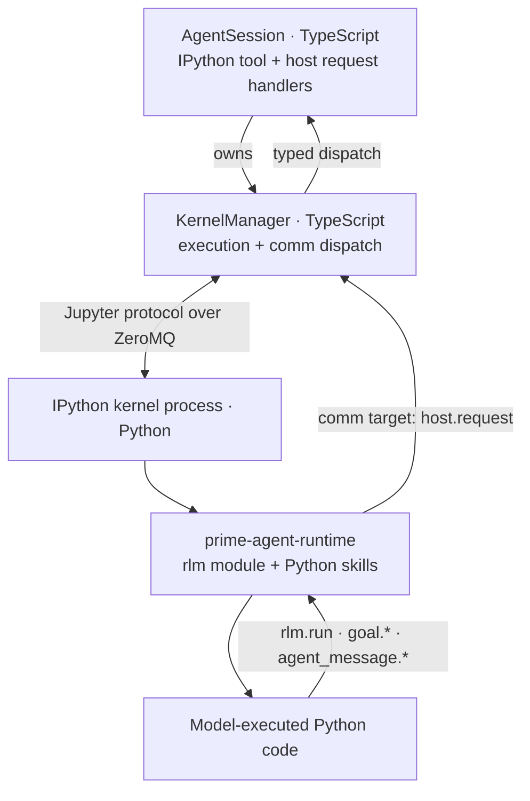
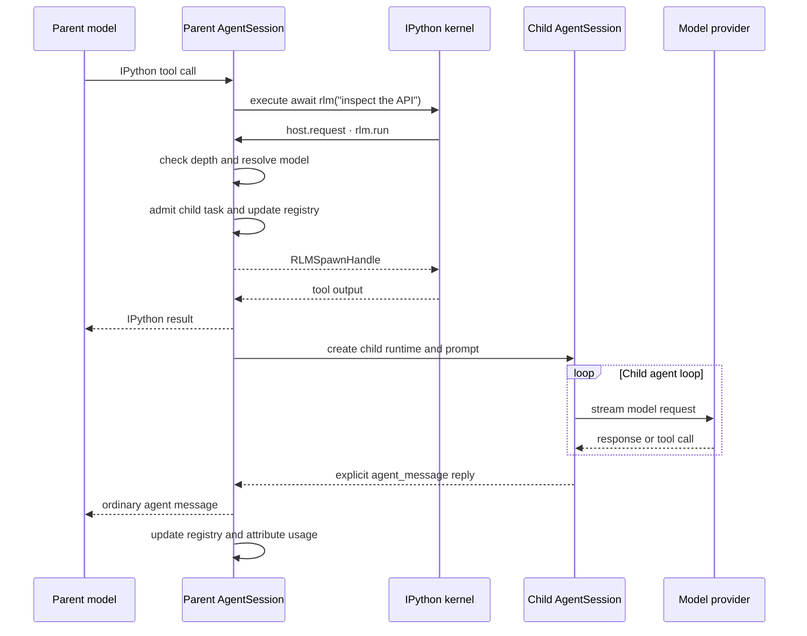

# Kiến trúc RLM Runtime

Prime Agent cung cấp cho mỗi agent session một kernel IPython bền vững và giao diện subagent đệ quy native. Package Python `rlm` là shim hướng đến model; host TypeScript sở hữu việc thực thi child, persistence, hạch toán usage và vòng đời.

## Kiến trúc



Khi model ủy thác công việc:

```python
handle = await rlm("inspect the API", name="api-reviewer")
print(handle.rlm_child_id, handle.name, handle.session_dir, handle.model)
```

Lời gọi đi qua Jupyter comm target `host.request`. `KernelManager` dispatch request type `rlm.run` đến `AgentSession` parent, khởi động child bằng cùng bộ máy TypeScript. Lời gọi trả về ngay sau admission cùng child handle; không chờ và không trả về câu trả lời của child. Kết quả chỉ đến qua reply `agent_message` rõ ràng hoặc tệp.

Cầu nối này cũng hỗ trợ các host request có kiểu khác. Python skill đi kèm như `goal` gọi `rlm.host_request("goal.get", ...)`; state và policy vẫn nằm trong host TypeScript.

## Luồng ủy thác



## Phân định trách nhiệm component

| Component | Trách nhiệm |
|---|---|
| `src/core/kernel/index.ts` | ZeroMQ socket, Jupyter framing, execution, comm dispatch, interrupt và shutdown. |
| `src/core/tools/ipython.ts` | Agent tool wrapper, lazy kernel, namespace bootstrap và định dạng output. |
| `src/core/agent-session.ts` | RLM policy, tạo child, registry, usage attribution, cancellation và goal handler. |
| `src/core/rlm-runtime.ts` | Validation typed cho `rlm.run`, spawn handle, model discovery, list và delete. |
| `prime-agent-runtime/src/rlm/` | Python shim, handle type, `rlm` callable và session-backed harness state. |

Phía Python không gọi provider và không triển khai agent loop.

## Vòng đời kernel

Kernel được tạo lazy khi dùng IPython lần đầu. Python được phân giải theo thứ tự:

1. `PRIME_AGENT_KERNEL_PYTHON`, khi import được `ipykernel`;
2. `~/.prime/agent/kernel-venv/bin/python`, được bootstrap bằng `uv`; hoặc
3. vị trí dữ liệu XDG khi `~/.prime` không ghi được.

Môi trường được quản lý gồm Python 3.11, `ipykernel` và `prime-agent-runtime`. Bootstrap marker phát hiện môi trường cũ.

Startup tạo tệp kết nối Jupyter tạm thời với loopback TCP port và HMAC key, khởi động `python -m ipykernel_launcher`, kết nối shell, IOPub và control socket, chờ subscription propagation rồi kiểm tra readiness bằng `kernel_info_request`.

Manager sở hữu child process, connection directory, ZeroMQ socket và bounded stderr tail. Shutdown gửi `shutdown_request`, đóng socket, terminate process dự phòng và xóa dữ liệu kết nối tạm. Session bền vững có thể snapshot kernel namespace vào session artifact directory để revival.

## Jupyter Transport

Prime Agent dùng ba channel:

```text
shell    execute_request, execute_reply, kernel_info_request
iopub    stdout, stderr, results, errors, status, comm_open
control  interrupt, shutdown, and host-request replies during execution
```

Message dùng multipart framing Jupyter thông thường:

```text
<IDS|MSG>
signature
header
parent_header
metadata
content
```

JSON frame được ký bằng HMAC-SHA256. Output thông thường chỉ được nhận khi `parent_header.msg_id` khớp execution đang hoạt động. Comm message được xử lý trước bộ lọc vì Python task bất đồng bộ có thể mở comm sau khi cell lập lịch quay về idle.

Các lần gọi `KernelManager.execute()` được serialize. Một kernel có namespace dùng chung và không chạy đồng thời hai IPython cell thông thường. RLM child vẫn chạy đồng thời được vì mỗi delegation dùng comm và child runtime riêng.

## Vì sao response host-request dùng Control Channel

Cell đang chạy có thể await admission:

```python
handle = await rlm("subtask")
```

IPython xử lý shell message tuần tự. Gửi admission response trên shell channel sẽ deadlock: `execute_request` không thể kết thúc trước response, còn kernel không xử lý shell response trước khi request kết thúc.

Vì vậy Python shim đăng ký comm handler trên control channel và host gửi admission response qua đó. Future completion được lên lịch bằng `loop.call_soon_threadsafe()` vì control handler có thể chạy trên thread khác. Câu trả lời child không dùng đường này; chúng đến sau qua `agent_message` hoặc tệp.

## Python API

`prime-agent-runtime` export:

```python
rlm
run(prompt: str, **kwargs)
find_models(query: str = "", limit: int = 8)
list_subagents()
delete_subagent(selector)
host_request(request_type: str, payload: dict | None = None)
RLMSpawnHandle
RLMModel
RLMSubagent
TokenUsage
```

IPython bootstrap đặt callable `rlm` vào user namespace, nên hai cách sau tương đương:

```python
await rlm("subtask")
await rlm.run("subtask")
```

`RLMSpawnHandle` chứa `rlm_child_id`, `name`, `session_dir` và `model`; chỉ xác nhận admission và không chứa câu trả lời child.

Option `rlm.run` hỗ trợ:

- `name`: tên child session duy nhất, dễ đọc; và
- `model`: selector `provider/model` chính xác từ `rlm.find_models()`.

Option lạ gây lỗi thay vì bị bỏ qua. Model search chỉ xét credential active, chưa hết hạn. Nếu selection không khả dụng hoặc auth preflight thất bại, spawn thất bại thay vì âm thầm fallback. Child nếu không có yêu cầu khác sẽ kế thừa model parent.

## Thực thi child

`AgentSession.runRlmChild()` thực hiện:

1. Kiểm tra `RLM_DEPTH < RLM_MAX_DEPTH`.
2. Phân giải model yêu cầu hoặc kế thừa model parent.
3. Tạo thư mục child `sub-xxxxxxxx` dưới artifact directory của parent.
4. Admit task vào parent registry và trả `RLMSpawnHandle`.
5. Trong detached work, tạo `SessionManager`, `Agent` và `AgentSession` child.
6. Dùng lại provider hook, resource loader, model registry, tool, transport, retry setting và thinking configuration.
7. Chạy prompt child, giữ session và cập nhật lifecycle độc lập với admission call.
8. Gán usage child cho parent assistant turn và lưu attribution.

Child nhận `RLM_DEPTH` tăng, maximum depth kế thừa và `RLM_SESSION_DIR` riêng. Maximum depth mặc định là 1: root tạo được child nhưng child không tạo grandchild nếu chưa cấu hình giới hạn cao hơn.

## Ủy thác độc lập

Mỗi lời gọi trực tiếp admit một child độc lập và trả handle ngay:

```python
api_review = await rlm("review the API", name="api-reviewer")
test_review = await rlm("review the tests", name="test-reviewer")
audit = await rlm("slow independent audit", name="audit-reviewer")
```

Kết thúc lượt thay vì chờ. Child gửi câu trả lời bằng `await agent_message.send(message, receiver_role="parent")`; reply đến như agent message ở lượt sau. Child cũng có thể ghi kết quả vào tệp. Host chạy mỗi child như một `AgentSession` độc lập; daemon-backed child có thể được giữ như session worker có địa chỉ riêng.

## Registry subagent theo parent

Parent TypeScript duy trì registry authoritative của direct child. `await rlm.list_subagents()` trả child ID ổn định, active-session ID khi daemon-backed, session ID, tên, thư mục và trạng thái running/completed.

Registry tồn tại qua kernel restart, compaction và parent restore. Daemon-backed child hoàn tất thành công được rehydrate từ parent artifact registry. Inline child vẫn inspect được trong process hiện tại nhưng không có active-session ID.

Parent có thể tiếp tục daemon child bằng `await agent_message.send(..., receiver_role="child", receiver_name=child.session_name)`. `rlm.delete_subagent()` nhận child ID, active-session ID, session ID chính xác hoặc tên duy nhất. Deletion cancel/close runtime, ghi durable tombstone và loại child khỏi messaging, observation; không xóa transcript hay artifact trên disk.

Registry đi theo parent transcript. Parent session mới không liên quan không kế thừa child.

## Gán usage và chi phí

Admission handle không chứa usage hay completion. Prime Agent bất đồng bộ gộp assistant usage và cost của child vào parent assistant turn đã khởi chạy nó.

Parent transcript lưu entry `child_usage_attributed` gồm:

- ID parent assistant message đích;
- usage child được gán; và
- aggregate usage kết quả.

Khi reload, aggregate được áp dụng lại cho parent message. Context-tree reporting trừ child usage đã gán khi hiển thị usage riêng của mỗi node, nên own usage toàn cây và root aggregate vẫn đối soát được. Child work tăng billable session totals nhưng không làm tăng context-window measurement của parent model.

## State harness liên tục

`rlm.harness` là state ledger bền vững cho prompt note, memory, mô tả skill tái sử dụng, subagent specification và refinement event; không phải execution engine thứ hai.

State cục bộ nằm tại `harness/harness_state.json` trong session artifact directory. Global entry rõ ràng nằm dưới `~/.prime/agent/harness/`. Python store reload sau sửa đổi bên ngoài để host-side `/refine` và kernel write không ghi đè nhau.

`/refine` review trajectory hiện tại và áp dụng chỉnh sửa create/update/delete nhỏ. Rollback dùng before/after snapshot đã ghi. Base system prompt bất biến; refinement là state bổ sung.

## Goal request

Python skill `goal` đi kèm là client mỏng của host bridge:

```python
await goal.get()
await goal.create("ship the release", token_budget=200000)
await goal.complete()
```

Goal state, persistence, token/wall-clock accounting và continuation prompting nằm trong `AgentSession`. Khi goal tắt, skill và host handler `goal.*` không được đăng ký.

## Session artifact

Với root session bền vững, layout liên quan là:

```text
~/.prime/agent/
  sessions/
    <root-session-id>.jsonl
  session-artifacts/
    <root-session-id>/
      kernel-state.dill
      kernel-state.json
      scheduled-jobs.json
      harness/
        harness_state.json
      sub-xxxxxxxx/
        <child-session-id>.jsonl
        sub-yyyyyyyy/
```

Artifact chính xác chỉ được tạo khi tính năng dùng đến. Session không persistent đặt RLM directory dưới OS temporary directory và không có revivable session artifact.

## Ranh giới tin cậy

IPython thực thi Python do model tạo và shell-magic với OS permission của worker. Kernel boundary cô lập protocol và lifecycle, không phải security sandbox. Python package, skill và extension đã cài là mã được tin cậy. Dùng external sandbox hoặc restricted execution khi workspace hay code tạo ra không đáng tin.

Provider credential được host TypeScript phân giải. Bounded model catalog đi vào Python dưới dạng metadata; full auth store không đi qua.

## Các chế độ lỗi

| Lỗi | Hành vi |
|---|---|
| Managed runtime bị thiếu | Kernel bootstrap rebuild; Python tùy chỉnh không có `rlm` báo lỗi rõ khi gọi recursion. |
| Đạt depth limit | Python raise trước khi mở comm; host kiểm tra lại. |
| Option không hỗ trợ | Host reject request. |
| Model yêu cầu không khả dụng | Spawn fail thay vì thay model khác. |
| Shell-channel comm reply | Có nguy cơ deadlock; reply hiện dùng control. |
| Child cancellation | Host abort child và loại failed/cancelled registry entry. |
| Parent teardown | Active descendant bị hủy và runtime của chúng được đóng. |

## Kiểm tra tập trung

Từ repository root, implementation được bao phủ bởi focused test cho kernel, recursion, context-tree, daemon RLM và runtime. Khi đổi child creation hoặc accounting, chạy `agent-session-recursion.test.ts`; khi đổi comm transport, chạy kernel comm test; khi đổi daemon retention, chạy daemon RLM lifecycle test.
