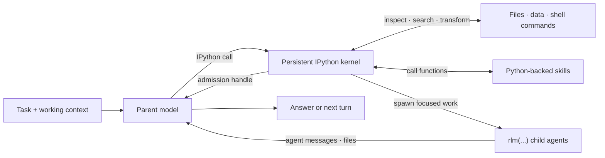

# Mô hình lập trình RLM

Prime Agent được xây dựng xoay quanh một runtime mô hình ngôn ngữ đệ quy (RLM): mô hình làm việc bên trong một môi trường điều khiển Python lâu dài và kết hợp các khả năng bằng mã. Các lệnh gọi nhà cung cấp, việc duy trì phiên, vòng đời tác nhân con, lập lịch và chính sách an toàn vẫn do host TypeScript quản lý; IPython là giao diện lập trình hướng tới mô hình.

## Vòng lặp RLM



Tác nhân cha giữ cho ngữ cảnh riêng của mình tập trung, còn Python lưu trạng thái làm việc và các tác nhân con chỉ nhận phần ngữ cảnh cần thiết cho nhiệm vụ của chúng.

## Các bất biến cốt lõi

### 1. Việc thực thi được lập trình hóa

Runtime RLM mặc định cung cấp một công cụ mô hình tích hợp duy nhất: `ipython`. Việc đọc và chỉnh sửa tệp, chạy lệnh dự án, biến đổi kết quả, gọi skill và ủy thác công việc đều bắt đầu từ kernel lâu dài đó thay vì các lệnh gọi công cụ tích hợp riêng lẻ.

Trạng thái Python tồn tại qua các lần gọi công cụ và quá trình nén ngữ cảnh. Biến, import, hàm, kết quả đã phân tích và handle nhiệm vụ vẫn có sẵn ở các lượt sau:

```python
from pathlib import Path

config_files = list(Path(".").rglob("*.toml"))
large_files = [path for path in config_files if path.stat().st_size > 10_000]
```

Chạy các lệnh thông thường của dự án thông qua môi trường riêng của dự án từ một ô IPython:

```bash
%%bash
npm run check
```

Mỗi ô `%%bash` là một shell con tạm thời, còn trạng thái Python và các thay đổi `%cd` vẫn tồn tại trong kernel. Các extension của Prime Agent có thể cố ý thêm công cụ tùy chỉnh, nhưng thiết kế RLM tích hợp không yêu cầu một công cụ mô hình riêng cho mọi khả năng.

### 2. Tác nhân con là các lệnh gọi RLM gốc

Đối tượng có thể gọi `rlm` được nạp sẵn trong kernel. Tạo một tác nhân con bằng một lệnh gọi trực tiếp:

```python
handle = await rlm("Review the authentication flow for security issues", name="auth-reviewer")
print(handle.rlm_child_id, handle.name, handle.session_dir, handle.model)
```

Lệnh gọi trả về ngay sau khi tiếp nhận nhiệm vụ cùng một handle tác nhân con; nó không bao giờ chờ hoặc trả về câu trả lời của tác nhân con. Host TypeScript tạo một `AgentSession` con thông thường với ngữ cảnh và thư mục phiên độc lập. Tác nhân con kế thừa mô hình, cấu hình nhà cung cấp, skill, công cụ, chính sách thử lại và resource loader của tác nhân cha, trừ khi lệnh gọi yêu cầu một mô hình đã cấu hình khác.

Tạo các tác nhân con độc lập bằng những lệnh gọi riêng và kết thúc lượt thay vì chờ hoàn tất:

```python
api_review = await rlm("Review the public API", name="api-reviewer")
test_review = await rlm("Review the test coverage", name="test-reviewer")
integration_audit = await rlm("Run the slow integration audit", name="integration-audit")
```

Kết quả chỉ đến qua các phản hồi `agent_message` tường minh hoặc qua tệp, không bao giờ là giá trị trả về của `rlm()`. Tác nhân con phản hồi khi cần đưa ra câu trả lời:

```python
await agent_message.send(message, receiver_role="parent")
```

Tác nhân cha có thể tiếp tục trao đổi với một tác nhân con vẫn được giữ lại:

```python
await agent_message.send(
    "Check the newly added regression test.",
    receiver_role="child",
    receiver_name=api_review.name,
)
```

#### Handle tác nhân con và vòng đời

Một admission handle chứa `rlm_child_id`, `name`, `session_dir` và `model`. Mức sử dụng của tác nhân con được quy cho phiên của tác nhân cha nhưng vẫn có thể phân biệt trong báo cáo cây ngữ cảnh.

Registry tác nhân con thuộc phạm vi tác nhân cha tồn tại qua quá trình nén ngữ cảnh, khởi động lại kernel và khôi phục tác nhân cha:

```python
children = await rlm.list_subagents()
for child in children:
    print(child.session_name, child.status, child.active_session_id)
```

Các tác nhân con được daemon hỗ trợ và đã hoàn tất thành công vẫn có thể được gọi đến khi phiên cha còn mở. Chỉ xóa một tác nhân con khi không còn cần ngữ cảnh của nó:

```python
await rlm.delete_subagent(children[0])
```

Độ sâu đệ quy mặc định cho phép tác nhân gốc tạo tác nhân con. Tăng độ sâu đã cấu hình sẽ cho phép các hậu duệ tiếp tục đệ quy.

### 3. Skill bổ sung khả năng lập trình hóa

Prime Agent hỗ trợ định dạng markdown Agent Skills và mở rộng định dạng này bằng các skill được hỗ trợ bởi Python. Cả hai đều dùng `SKILL.md` để phát hiện, định tuyến và cung cấp hướng dẫn. Skill được hỗ trợ bởi Python còn chứa một gói Python mà Prime Agent cài vào môi trường kernel và cung cấp thông qua tên import.

Với skill có tên `release-audit`, mô hình có thể gọi:

```python
report = await release_audit(repository=".", target_version="0.4.0")
```

Điều này khiến skill được hỗ trợ bởi Python trở thành một dạng mở rộng của skill chỉ chứa hướng dẫn: chúng có thể cung cấp hướng dẫn, script, tài liệu tham chiếu, dependency, callable có kiểu và các lệnh shell tùy chọn. Chúng cũng có thể tự gọi `rlm(...)` khi một khả năng cần ủy thác đệ quy.

Chỉ metadata của skill được đưa vào prompt khởi động. Khi nhiệm vụ phù hợp, tác nhân tải toàn bộ `SKILL.md`, rồi kiểm tra và gọi API Python được mô tả. Xem [Skills](skills.vi.md) để biết cách phát hiện, đóng gói và quy trình tạo skill tích hợp.

### 4. Trạng thái được thiết kế để tồn tại lâu hơn một lượt

Mô hình lập trình RLM giả định rằng công việc hữu ích có thể cần nhiều lượt hoặc tiếp tục sau khi giao diện terminal đóng:

- tính năng nén tự động tóm tắt ngữ cảnh cũ hơn trong khi giữ lại các tin nhắn gần đây và trạng thái kernel;
- worker do daemon hỗ trợ giữ cho các phiên đang hoạt động tiếp tục chạy sau khi client tách khỏi phiên;
- registry tác nhân con và các artifact phiên giúp có thể khôi phục các tác nhân con;
- heartbeat và prompt được lập lịch đưa một phiên hoạt động trở lại sau đó;
- mục tiêu lâu dài tiếp tục cho đến khi hoàn thành mục tiêu hoặc người dùng thay đổi trạng thái của mục tiêu; và
- chế độ tự động bổ sung các lượt tiếp tục có giới hạn cùng các cổng kiểm tra chất lượng tùy chọn.

Xem [Tác nhân chạy lâu dài và chạy nền](long-running-agents.vi.md) để biết các tính năng vòng đời này.

## Cầu nối host

Các skill Python sử dụng những yêu cầu host có kiểu cho các khả năng mà trạng thái có thẩm quyền nằm bên ngoài kernel. Ví dụ, các skill `goal`, `agent_message`, `rlm_heartbeat` và `compact` gọi `rlm.host_request(...)`; host TypeScript xác thực yêu cầu và sở hữu việc chuyển đổi trạng thái.

Điều này giữ thông tin xác thực, việc thực thi từ nhà cung cấp, ghi transcript, định tuyến worker và lập lịch ở bên ngoài Python, đồng thời vẫn duy trì giao diện mô hình có thể lập trình.

## Mô hình tin cậy

Kernel IPython chạy Python do mô hình tạo ra và các lệnh dự án với quyền của hệ điều hành mà worker có. Đây là một môi trường điều khiển lâu dài, không phải sandbox bảo mật. Hãy xem xét các skill Python của bên thứ ba và sử dụng sandbox bên ngoài hoặc môi trường bị hạn chế cho các repository và hướng dẫn không đáng tin cậy.

Để biết chi tiết triển khai, xem [Kiến trúc runtime RLM](rlm-runtime.vi.md).
